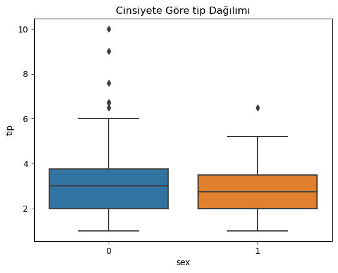
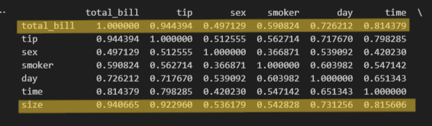
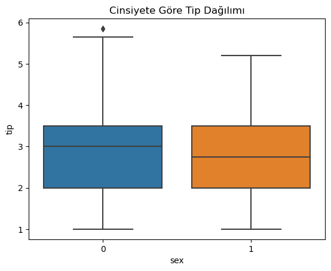

Bu projede tips.csv dataset'i seçilmiş, data preprocessing işlemleri yapılmış ve çeşitli öğrenme algoritmalarıyla testler yapılmıştır. 

**data preprocessing için:**
1) null değerler kontrol edildi. Dataset'te hiç null değere rastlanmadı.
2) Gerekli yerlerde string verinin binary değer dönüşümü yapıldı. Örneğin:

df['smoker'] = df['smoker'].map({'Yes': 1, 'No': 0})
df['sex'] = df['sex'].map({'Female': 1, 'Male': 0})
df['time'] = df['time'].map({'Dinner': 1, 'Lunch': 0})

**Bu datasette verilecek tip label olarak belirlenmiştir. Bu aşamadalarda artık tip verisinin diğer  verilerle olan ilişkileri incelenecektir.**

3) Öncelikle kategorik olmayan continous değerlerin (total_bill, size) tip (label) ile olan korelasyonuna bakıldı. Bunun için pearson korelasyonu hesaplandı. Örneğin:

correlation = df['total_bill'].corr(df['tip'])
print('Pearson Korelasyon Katsayısı:', correlation) 
**Output**: Pearson Korelasyon Katsayısı: 0.6757341092113646 şeklindedir. 

4) haftanın günleri sayısal degere cevrildi.
5) cinsiyete göre verilen tip oranına bakıldı. Burada her iki cinsiyet için de verilen tipler birbirine çok yakın olsa da. Erkeklerde aykırı değerlerin şekildeki gibi daha fazla çıktığı görüldü. 

6) Datasetteki bütün veriler sayısala çevrildikten sonra hepsinin birbiriyle olan ilişkisini inceleyip benzer rakamlara sahip olanları aynı feature'da birleştirme amacıyla cosine similarity özelliğine bakıldı.
7) cosine similarity'de size ve total_bill çok benzer olduğu görüldü ve tek feature'a indirgendi.

8) 5. aşamadaki cinsiyette oluşan aykırı değerler mean değere indirgendi. Bunun için çeyrekler açıklığı kullanıldı ve df tekrar düzenlendi.

**model oluşturma:**
1) model kendi datasetim için fit edildi, mean squared error hesaplandı.
2) sınıflandırma algoritmaları için tip sütunu continous feature olduğundan kategorik veriye çevrilmesi gerekiyordu. Aşağıdaki kodda görüldüğü gibi Float->int dönüşümü yapıldı ve sonuçta tip özelliği 1-6 arası seyrettiği için 6 kategoriye ayrıldı. 

_df['integer_part'] = df['tip'].apply(lambda x: int(x))
df['tip'] = df['integer_part']
df = df.drop(columns=['integer_part'])_
y = df['tip']

3) train ve test aralıklarının belirlendi. SVM için Scaler işlemi yapıldı.
4) Sırasıyla decision tree, KNN ve Logistic Regression algoritmaları model üzerinde test edildi. Her model için accuracy score'lar hesaplandı. 
